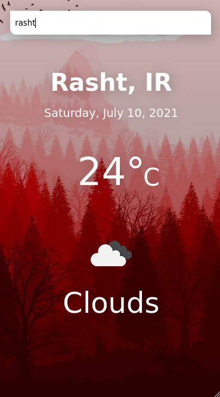
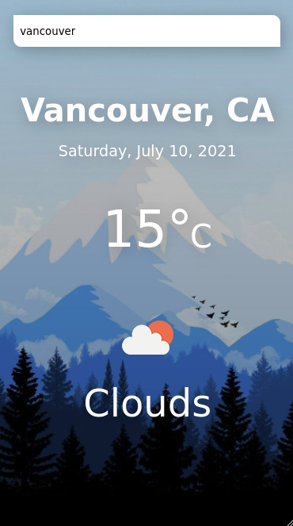
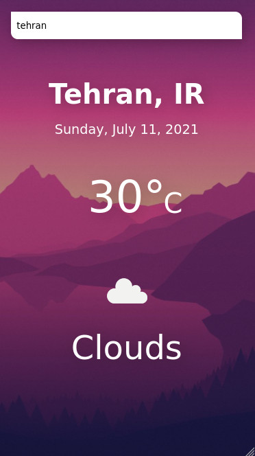
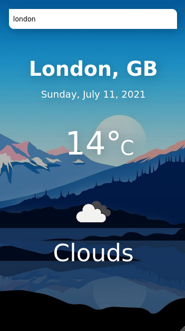

# weather

<h1 align="center">Note:<br/> For a better look, you should activate the responsive design mode of your browser and set it to mobile mode.</h1>

## Project view







## Project setup
```
npm install
```

### Compiles and hot-reloads for development
```
npm run serve
```

### Compiles and minifies for production
```
npm run build
```

### Lints and fixes files
```
npm run lint
```

### Customize configuration
See [Configuration Reference](https://cli.vuejs.org/config/).
